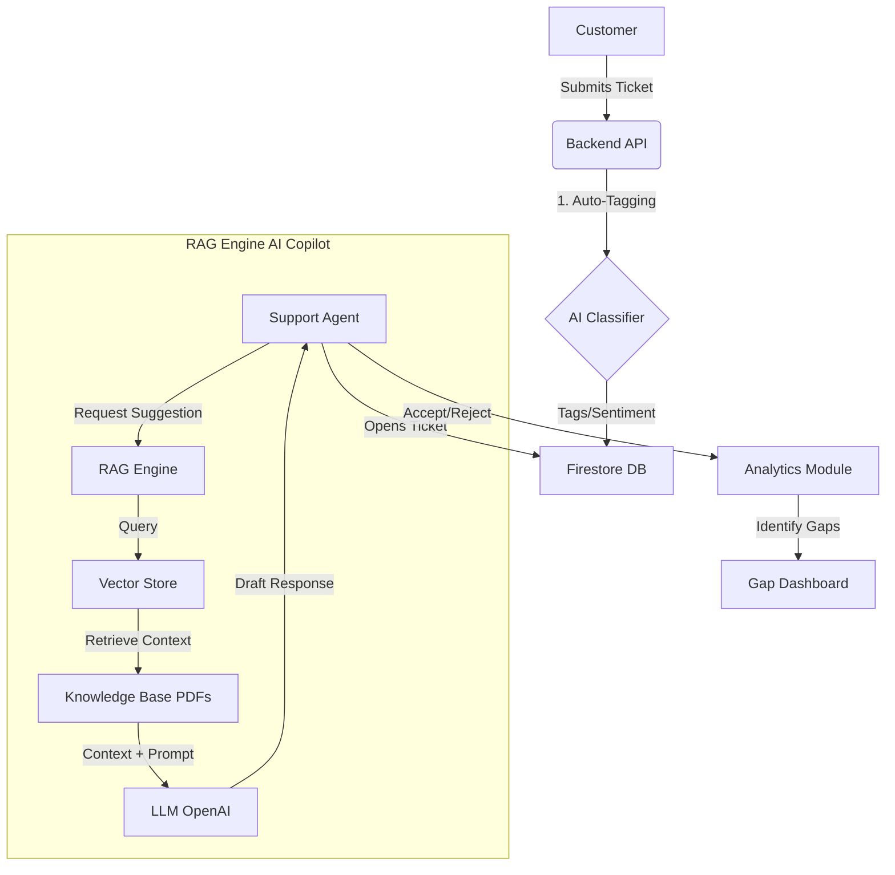

# AI Support Engine: Project Workflow & Architecture

## 1. Project Objective
To build an intelligent, **AI-powered Knowledge Management Platform** that assists customer support agents by:
*   **Auto-classifying** incoming tickets (Tags, Sentiment, Priority).
*   **Suggesting real-time responses** based on a Knowledge Base (RAG).
*   **Detecting content gaps** based on agent feedback.

---

## 2. High-Level Workflow



---

## 3. Key Modules & Technical Implementation

### A. Knowledge Ingestion (The "Brain")
*   **Input**: Support Policy PDFs.
*   **Process**: 
    1.  **Chunking**: Text is split into small, meaningful segments.
    2.  **Embedding**: Chunks are converted into vector numbers (using OpenAI Embeddings).
    3.  **Storage**: Vectors are saved in a local Vector Store for fast semantic search.

### B. Intelligent Ticket Handling
*   **Trigger**: When a customer creates a ticket.
*   **Action**: The system instantly analyzes the text to assign:
    *   **Tags**: e.g., "Billing", "Technical".
    *   **Sentiment**: "Positive", "Neutral", "Negative".
    *   **Priority**: "High" (if urgent/negative), "Medium", "Low".

### C. The "AI Copilot" (RAG System)
*   **Trigger**: Agent clicks "Generate Draft".
*   **Action**: 
    1.  The system searches the Vector Store for policy chunks relevant to the user's issue.
    2.  It feeds the user's question + the retrieved policy chunks to GPT-4.
    3.  GPT-4 generates a polite, accurate response citing the specific policy.

### D. Gap Analysis (Continuous Improvement)
*   **Trigger**: Agent rejects an AI suggestion.
*   **Action**: The system logs the "failure."
*   **Outcome**: The Analytics Dashboard highlights these rejected topics, telling managers: *"We are missing content about X topic."*

---

## 4. Technology Stack
*   **Frontend**: React.js, Tailwind CSS (Glassmorphism UI).
*   **Backend**: FastAPI (Python).
*   **Database**: Google Firestore (NoSQL Real-time DB).
*   **AI/ML**: OpenAI GPT-4 (Reasoning), OpenAI Embeddings (Vector Search), FAISS/Numpy (Vector Store).

---

## 5. How to Run the Project

### Backend (API & AI Engine)
```bash
cd ai_support_engine
python src\main.py
# Runs on http://localhost:8000
```

### Frontend (User Interface)
```bash
cd frontend
npm run dev
# Runs on http://localhost:3000
```

### Option B: Running with Docker (Recommended)
Run the entire stack (Frontend + Backend) with a single command:

1.  **Setup Environment**: Ensure your `ai_support_engine/.env` file is populated.
2.  **Run**:
    ```bash
    docker-compose up --build
    ```
    *   **Frontend**: http://localhost:3000
    *   **Backend**: http://localhost:8000

